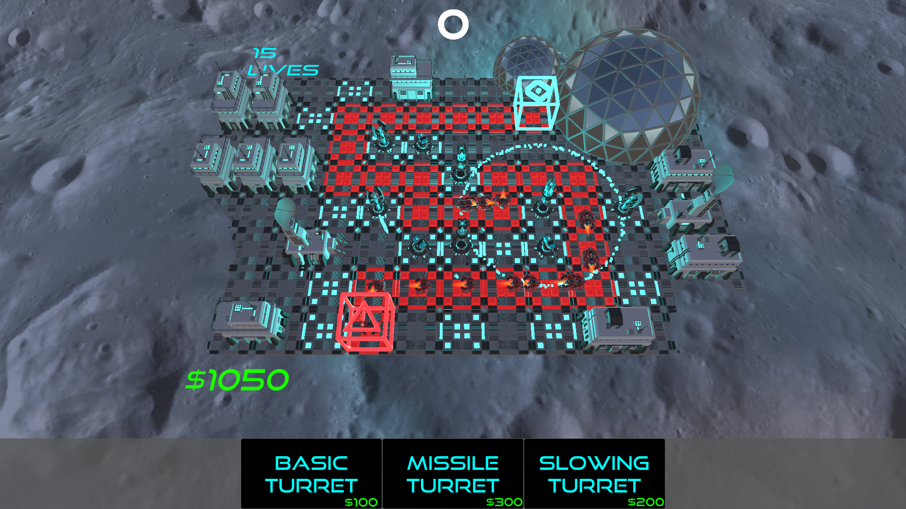
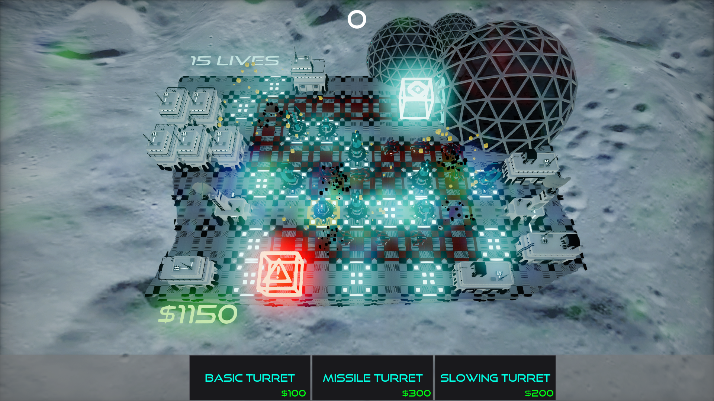

# SpaceDefence

As a part of master thesis i had to make the same game twice in two diffrent engines and compare the performance. My engines of choice were Unity 3D and Flax Engine.

# Description
I decided to create a tower defence game as it has a lot of working components at the same time, so it would generate interesing results. 

# Features
* Three diffrent enemy types
* Three diffrent turret types
* Demo level with already placed turrets for measurement purposes
* One fully playable level

# Preview
### __Unity 3D__

---

### __Flax Engine__

---
